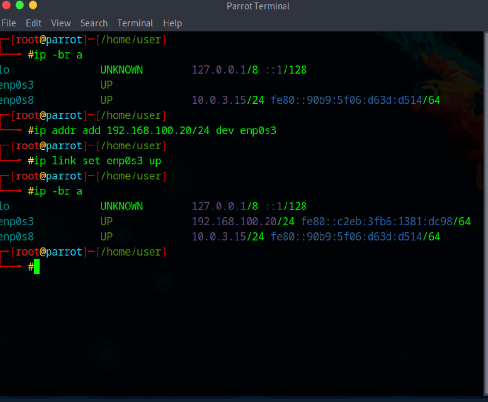
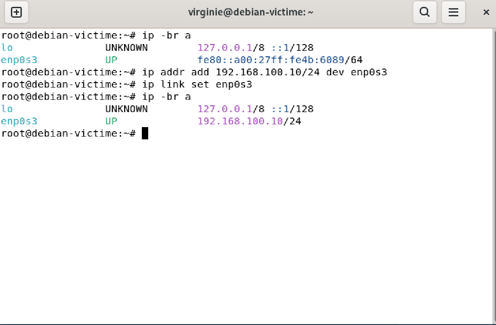
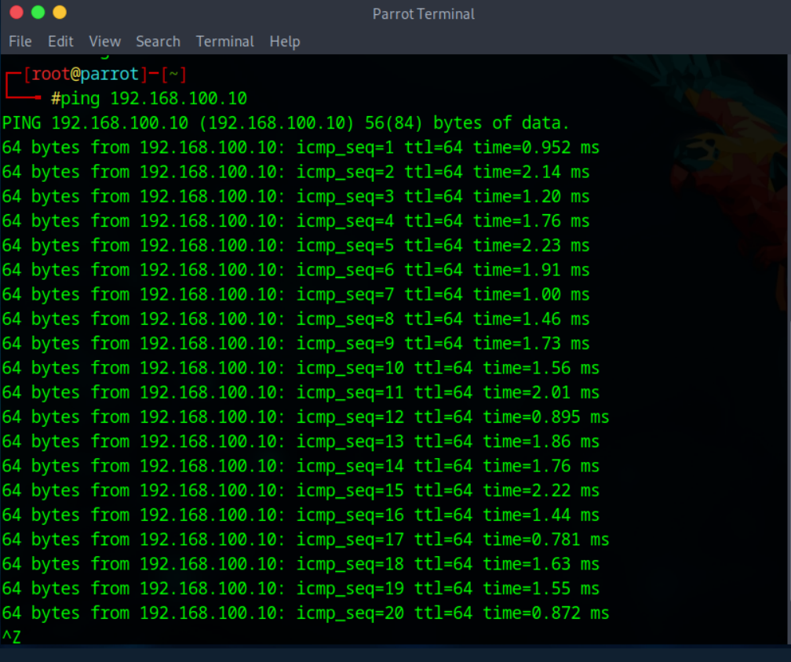
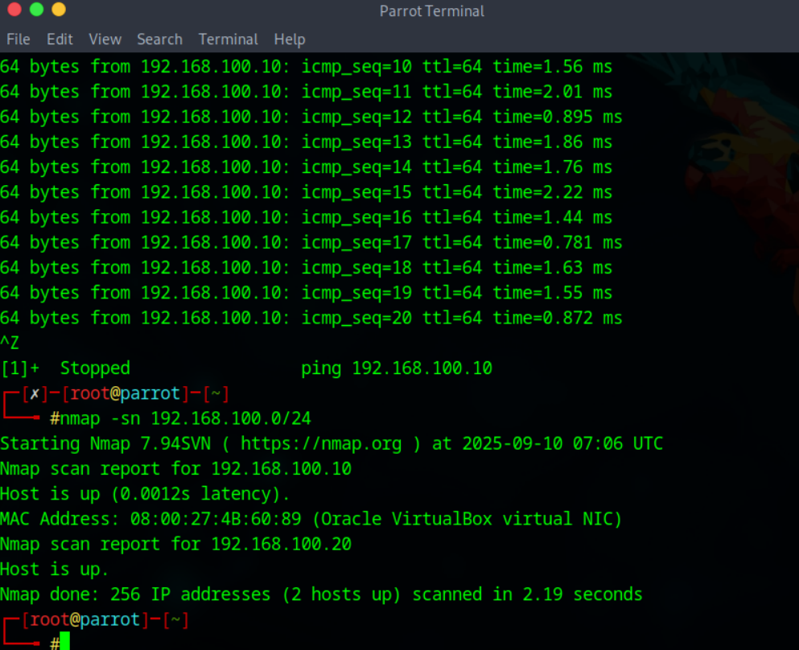
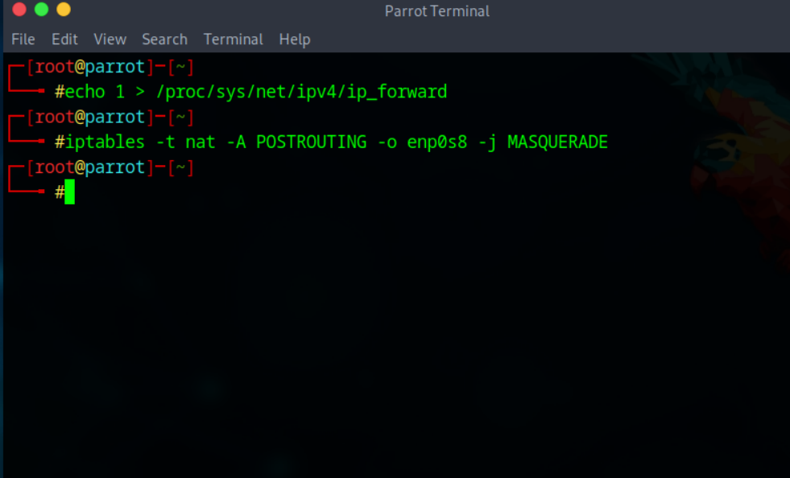
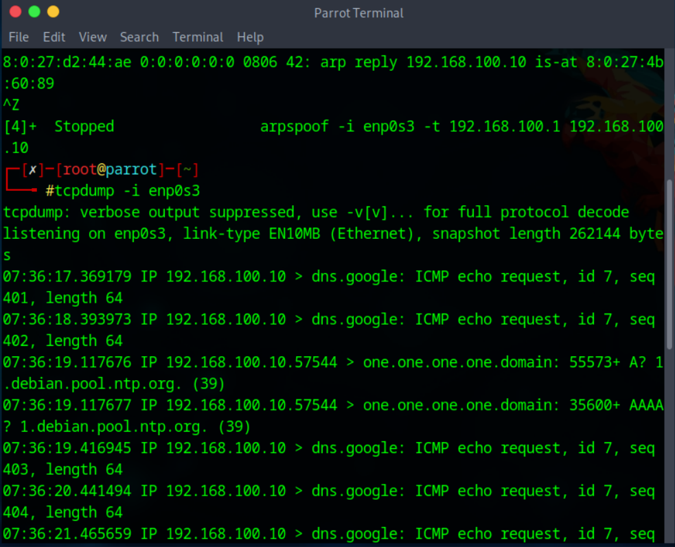
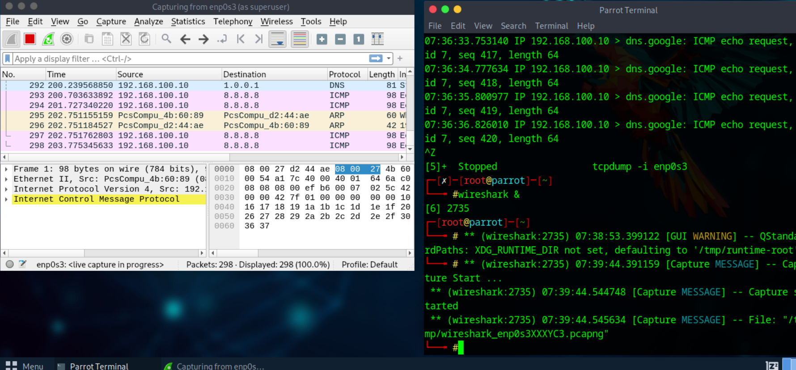
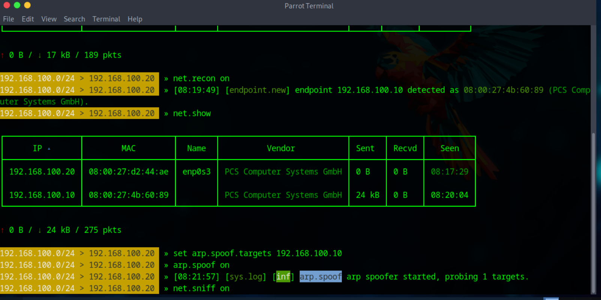
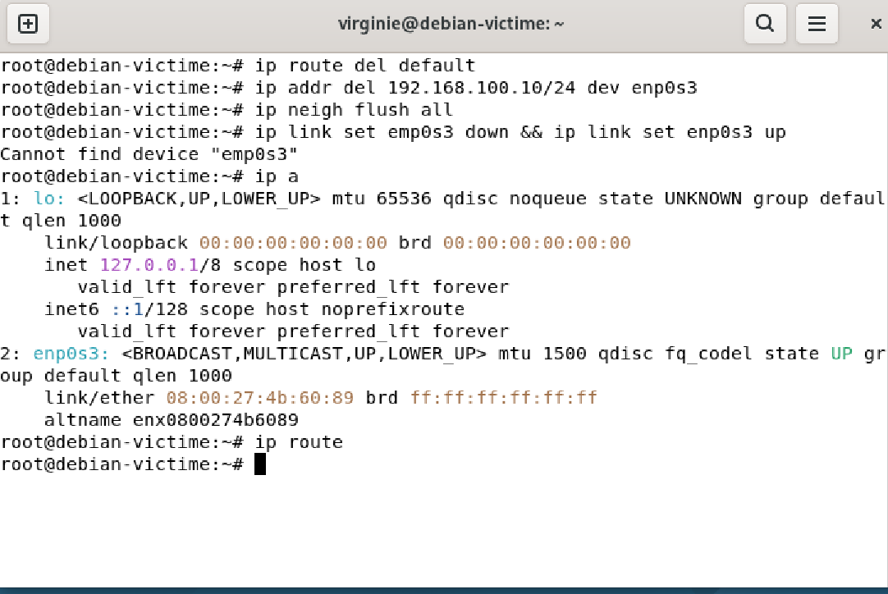
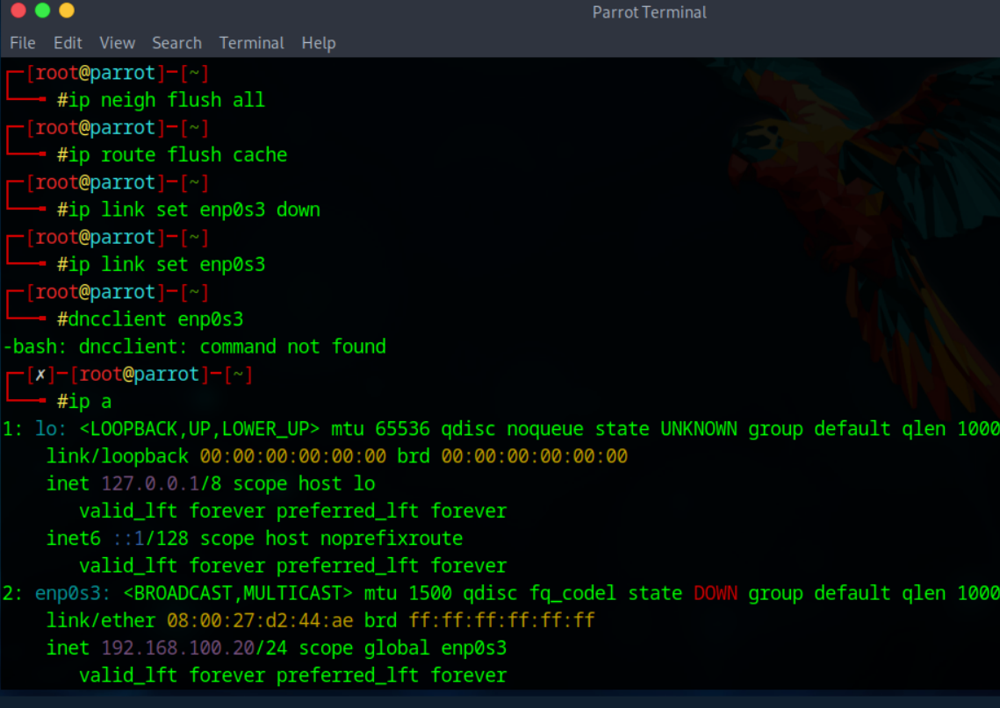

# MITM Attack Scénario, du Hacking à la défense

© 2025 Virginie Lechene

---

# MITM Attack

---

## 🎯 Objectif

Reproduire, dans un **laboratoire VirtualBox contrôlé**, le principe d’une attaque **Man-in-the-Middle (MITM) par ARP spoofing** afin de comprendre comment un attaquant peut se positionner entre une victime et sa passerelle réseau.

Ce laboratoire permet notamment de :

- observer les communications entre les machines du réseau ;
- comprendre le fonctionnement de l’**ARP spoofing** ;
- analyser le trafic avec **tcpdump** et **Wireshark** ;
- observer les effets d’une attaque MITM ;
- étudier les méthodes de **détection et de protection** contre ce type d’attaque.

> [!WARNING]
> **Usage légal et éthique uniquement.**  
> Ce projet est réalisé exclusivement dans un environnement de laboratoire contrôlé. Les techniques présentées sont destinées à l’apprentissage de la cybersécurité, à la défense et aux tests d’intrusion explicitement autorisés.

---

## Table des matières

1. [Introduction](#introduction)
2. [Prérequis techniques](#prérequis-techniques)
3. [Logiciels utiles](#logiciels-utiles-côté-parrot)
4. [Paramétrage VirtualBox](#paramétrage-virtualbox)
5. [Configuration IP & tests LAN](#configuration-ip--tests-lan)
6. [Découverte réseau (Nmap)](#découverte-réseau-nmap)
7. [Transformer Parrot en routeur NAT](#transformer-parrot-en-routeur-nat)
8. [Observation du trafic (tcpdump / Wireshark)](#observation-du-trafic-tcpdump--wireshark)
9. [Attaque MITM](#attaque-mitm-bettercap-ou-arpspoof)
10. [Proxy / Burp](#option-proxyburp-http)
11. [Nettoyage complet](#nettoyage-complet-des-machines)
12. [Bonnes pratiques Wi-Fi public](#se-protéger-sur-un-wi-fi-public)
13. [Résumé & Conclusion](#résumé-express)
	
---

## 🌐 Contexte : attaque MITM par ARP spoofing

Sur un réseau local, un attaquant présent sur le même segment réseau qu’une victime peut tenter de se positionner entre celle-ci et sa passerelle.

Une technique courante consiste à effectuer un **empoisonnement ARP (ARP spoofing)** afin d’associer l’adresse IP de la passerelle à l’adresse MAC de la machine attaquante.

L’attaquant peut alors :

- intercepter une partie du trafic réseau de la victime ;
- observer certains flux non chiffrés ;
- analyser les requêtes réseau avec des outils comme **tcpdump** ou **Wireshark** ;
- étudier les traces laissées par l’empoisonnement ARP.

👉 Dans ce projet, cette situation est reproduite **uniquement dans un laboratoire VirtualBox contrôlé** afin de comprendre le fonctionnement de l’attaque, son observation, sa détection et les moyens de s’en protéger.
 
---

## Prérequis techniques

- VirtualBox 7.x ou supérieur
- 2 VM : Parrot OS (attaquant), Debian (victime)
- RAM : 2 Go minimum par VM
- CPU : 2 cœurs conseillés

---

##  Guide rapide

1. Importer les 2 VM (Parrot & Debian) dans VirtualBox.  
2. Configurer les interfaces réseau (Parrot NAT + LAB, Debian LAB).  
3. Lancer les VMs.  
4. Suivre le scénario pas à pas → depuis la section [Configuration IP & tests LAN](#configuration-ip--tests-lan).  

          🌍 Internet   (sortie NAT VirtualBox)
              │
          (NAT)
              │
        🦜 Parrot OS (Attaquant)
              │
        🔗 Réseau LAB
              │
       🖥️ Debian (Victime)

📌 **Légende :**

Dans ce TP, la machine Parrot dispose d’une interface **NAT VirtualBox** pour l’accès sortant à Internet, ainsi que d’une interface connectée au **réseau interne LAB**.

Le réseau utilisé pour les manipulations entre Parrot et Debian reste isolé dans VirtualBox et ne doit être utilisé que dans cet environnement de laboratoire contrôlé.

--- 

##  Architecture du labo & prérequis  

### VMs  

**Parrot OS (attaquant)**  
- NIC1 : NAT (sortie Internet de la VM) → enp0s8 (ex. 10.0.3.15/24)  
- NIC2 : Réseau interne (LAB) → enp0s3  

**Debian (victime)**  
- NIC1 : Réseau interne (LAB) → enp0s3  

---

###  Plan d’adressage (réseau interne LAB)  
- Parrot (enp0s3) : 192.168.100.20/24  
- Debian (enp0s3) : 192.168.100.10/24  
- Passerelle "vue par Debian" : 192.168.100.20 (Parrot)  

---

### Logiciels utiles (côté Parrot)  
- nmap  
- bettercap (ou dsniff/arpspoof)  
- tcpdump  
- wireshark  
- iptables  

- **nmap** : outil de scan réseau permettant de découvrir les machines et services actifs.  
- **bettercap** (ou **dsniff / arpspoof**) : framework d’attaque réseau, utilisé ici pour réaliser un MITM via ARP spoofing.  
- **tcpdump** : analyseur de paquets en ligne de commande, pratique pour observer rapidement le trafic.  
- **wireshark** : analyseur de paquets graphique, permettant d’inspecter en détail les flux réseau.  
- **iptables** : outil de configuration du pare-feu Linux, utilisé pour filtrer et sécuriser le trafic.  

---

##  Paramétrage VirtualBox  

**Parrot → Paramètres > Réseau**  
- Carte 1 : NAT  
- Carte 2 : Réseau interne → Nom : LAB  

**Debian → Paramètres > Réseau**  
- Carte 1 : Réseau interne → Nom : LAB  

➡️ Lancez ensuite les deux VMs.  

---

## 🔢 Configuration IP & tests LAN  

### Parrot (root)  
ip addr add 192.168.100.20/24 dev enp0s3   
ip link set enp0s3 up    
ip -br a  

### Debian (root)  
ip addr add 192.168.100.10/24 dev enp0s3   
ip link set enp0s3 up   
ip -br a

## 🔢 Configuration IP & tests LAN

<table>
<tr>
<td align="center"><b>Parrot (attaquant)</b> 

</td>
<td align="center"><b>Debian (victime)</b> 

</td>
</tr>
</table>

---

### ✅ Tests LAN  
Depuis Debian :  

ping 192.168.100.20

Depuis Parrot :  
ping 192.168.100.10

✔️ Réponses reçues = réseau interne OK  

**Tests ping**

---

## 🔎 Découverte réseau (Nmap)  

Sur Parrot :  
nmap -sn 192.168.100.0/24

Résultat attendu :  
- 192.168.100.10 (Debian)  
- 192.168.100.20 (Parrot)

## 🔎 Découverte réseau (Nmap)

## 🔁 Transformer Parrot en routeur NAT  

### Sur Parrot (root)  

Activer le routage IPv4 (temporaire) :  

echo 1 > /proc/sys/net/ipv4/ip_forward

iptables -t nat -A POSTROUTING -o enp0s8 -j MASQUERADE

---

## 🌐 Configurer la victime pour sortir sur Internet via Parrot  

### Sur Debian (root)  

Définir Parrot comme passerelle par défaut :  
ip route add default via 192.168.100.20 dev enp0s3

### Tester l'accès Internet et la résolution DNS

Tester la connectivité Internet :  

ping -c 3 8.8.8.8   

Puis tester la résolution DNS :   

ping -c 3 google.com   

✅ Si 8.8.8.8 répond, la connectivité réseau fonctionne.   
✅ Si google.com répond également, la résolution DNS fonctionne.   

---

## Observation du trafic (tcpdump / Wireshark)

 tcpdump (rapide)

bash
tcpdump -i enp0s3 ou pour DNS uniquement
tcpdump -i enp0s3 port 53

### Wireshark 

Lancer Wireshark sur Parrot → interface enp0s3 (réseau LAB).

Filtres utiles (dans la barre de filtre d’affichage) :

dns → requêtes DNS

icmp → pings

 http → HTTP en clair

ip.addr == 192.168.100.10 → trafic de la victime

💡 Vous pouvez aussi ouvrir le fichier /root/capture.pcap généré par Bettercap pour l’analyser directement.

### 👀 Observation du trafic (tcpdump / Wireshark)

- 📸 tcpdump  
  
[Voir en grand](./senarioTCP.PNG)

**Wireshark**

---

## 🕵️ Attaque MITM (Bettercap ou arpspoof)  

### Option A - Bettercap *(recommandé)*  

Sur Parrot :  
bettercap -iface enp0s3

Dans la console bettercap :  
net.recon on
net.show

set arp.spoof.targets 192.168.100.10
arp.spoof on

set net.sniff.output /root/capture.pcap
net.sniff on

arpspoof -i enp0s3 -t 192.168.100.10 192.168.100.1
arpspoof -i enp0s3 -t 192.168.100.1 192.168.100.10

ℹ️ Ici `192.168.100.1` représente la “passerelle” vue par la victime.  
👉 Dans notre montage, où Parrot **est déjà la passerelle**, il est plus simple et plus sûr d’utiliser **Bettercap**.  

📸 Exemple d’exécution :

---

### 🧪 Option : Proxy/Burp (HTTP)

> **Note :** Intercepter du trafic HTTPS exige la gestion de certificats (CA Burp).
> Pour ce TP, on garde simple → uniquement HTTP.

---

#### ⚙️ Configuration Burp (attaquant - Parrot)
- **Proxy > Proxy Listeners** : écouter sur `192.168.100.20:8080`

#### ⚙️ Configuration Firefox (victime - Debian)
- **Paramètres réseau** → Configuration manuelle du proxy
- HTTP Proxy : `192.168.100.20`
- Port : `8080`
- (Option) Cochez *Utiliser également ce proxy pour HTTPS* seulement si vous avez installé la CA.
Sinon, gardez-le uniquement pour les tests HTTP.

#### 🔎 Test
1. Dans Burp → `Proxy > Intercept` : **Intercept is on**
2. Depuis Debian → ouvrez un site HTTP comme :
👉 `http://example.com`
3. Les requêtes doivent apparaître dans Burp.

➡️ Si rien n’apparaît :
- Vérifiez IP et port.
- Assurez-vous que l’écouteur Burp est actif.
- Confirmez que Firefox n’est pas réglé sur "Pas de proxy".

---

## 🛡️ Script de protection : `protect_mitm.sh`

En plus de la démonstration des attaques **MITM (Man-in-the-Middle)**, ce projet inclut un script de **protection** permettant de sécuriser une machine contre l’**ARP spoofing** et le **DNS spoofing**.  

### Fonctionnalités
- Vérifie la présence des outils nécessaires (`ip`, `arptables`, `iptables`).  
- Applique une **entrée ARP statique** pour la passerelle afin de bloquer les usurpations ARP.  
- Définit une **politique ARP stricte** :  
  - `DROP` par défaut,  
  - autorise uniquement la passerelle définie.  
- Verrouille le **DNS** vers un résolveur de confiance (par défaut `1.1.1.1`).  
- Optionnel : met à jour `/etc/resolv.conf` pour forcer l’utilisation du DNS choisi.  

### ✅ Avantages
- Protège efficacement contre les attaques MITM basées sur **ARP spoofing**.  
- Évite les détournements de résolution DNS.  
- Compatible **Debian / Ubuntu / Parrot**.  

### Utilisation

chmod +x protect_mitm.sh
sudo ./protect_mitm.sh

### 📌 Note d’usage

Ce dépôt propose un **script de protection MITM (ARP/DNS) à visée démonstrative**.  
Il illustre les **principes de défense réseau** contre l’ARP spoofing et le DNS spoofing, mais il est **volontairement strict** et donc peu adapté à une utilisation quotidienne.  

---

##  Nouveau script : protect_pro.sh

Après mon premier script (**protect_mitm.sh**), voici une version améliorée : **protect_pro.sh** 🚀  

✅ Modes block ou detect  
✅ Sauvegarde/restauration (iptables, arptables, sysctl)  
✅ Entrée ARP statique (anti ARP spoofing)  
✅ Verrouillage DNS (ex. 1.1.1.1)  
✅ Logs détaillés  

📸 **Preuve en image** :  
1.1.1.1 autorisé ✅ | 8.8.8.8 bloqué 🚫  

 **Objectif** : un labo pédagogique pour montrer comment passer d’un script simple à une version plus robuste et professionnelle contre les attaques **Man-in-the-Middle (MITM)**.  

⚠️ **Note importante**  
Ce script est avant tout **pédagogique** :  
- Idéal pour apprendre, tester et sensibiliser  
- Utile en lab de formation, pentest interne ou POC  
- Pas destiné tel quel à la production, mais les entreprises peuvent s’en inspirer pour renforcer leurs défenses

---

### 🧹 Nettoyage complet des machines

Debian (victime)

-  Supprimer la route par défaut (via Parrot) :
ip route del default  

- (Facultatif) Enlever l’IP labo si configurée manuellement :
ip addr del 192.168.100.10/24 dev enp0s3  

- Purger le cache ARP :
ip neigh flush all  

-  Redémarrer proprement l’interface :
ip link set enp0s3 down && ip link set enp0s3 up  

- (Option) Rétablir /etc/resolv.conf :
printf 'nameserver 1.1.1.1\n' > /etc/resolv.conf  

- Vérifications :
ip -br a
ip route

---

Parrot (attaquant)

- Stopper Bettercap / arpspoof / tcpdump / Wireshark :
- pkill -9 bettercap arpspoof tcpdump wireshark 2>/dev/null

- Désactiver le routage :
- echo 0 > /proc/sys/net/ipv4/ip_forward  

- Supprimer la règle NAT :
- iptables -t nat -D POSTROUTING -o enp0s8 -j MASQUERADE  

- Purger ARP et cache des routes :
- ip neigh flush all
- ip route flush cache  

- (Facultatif) Enlever l’IP labo si configurée manuellement :
- ip addr del 192.168.100.20/24 dev enp0s3 2>/dev/null  

- Redémarrer proprement l’interface :  
- ip link set enp0s3 down && ip link set enp0s3 up

- Vérifications :  
- ip -br a
- iptables -t nat -S | grep POSTROUTING || echo "NAT nettoyé ✅

---

## Se protéger sur un Wi-Fi public

### 🔒 Bonnes pratiques utilisateur
- ☑️ **Utiliser un VPN** → chiffre tout le trafic même si le Wi-Fi est compromis.
- ☑️ **Éviter les réseaux ouverts** (sans mot de passe WPA2/WPA3).
- ☑️ **Désactiver la connexion automatique** aux anciens hotspots enregistrés.
- ☑️ **Ne jamais installer de certificats inconnus** (ex. si une page vous demande d’accepter un certificat → à fuir !).
- ☑️ **Privilégier 4G/5G** pour les opérations sensibles (banque, achats).
- ☑️ **Vérifier les certificats dans le navigateur** (alerte = stop immédiat).
- ☑️ **Désactiver le partage de fichiers** (Windows / macOS → couper “Partage réseau”).

---

###  Côté administrateur (Wi-Fi public)
- Configurer le Wi-Fi avec **WPA2-Enterprise / WPA3** (éviter l’ouvert sans mot de passe).
- Mettre en place une **segmentation VLAN** (isolation client-à-client).
- Activer **Dynamic ARP Inspection (DAI)** et **Port Security** sur l’infra réseau.
- Surveiller le réseau avec un **IDS/IPS** (détection ARP spoof, DNS falsifiés).

---

###  Résumé express
- 🔗 VPN obligatoire
-  Éviter les réseaux ouverts
- 🔐 WPA2/WPA3 + isolation clients
-  Pas de certificats douteux
-  Si doute → passer en 4G/5G
	
---

### 🔒 Conclusion - Attaques MITM et scénario Wi-Fi public

Le scénario présenté illustre une attaque **MITM en environnement de type Wi-Fi public**, où l’attaquant peut se positionner entre la victime et la passerelle pour intercepter, modifier ou bloquer le trafic.

Mais il existe **plusieurs variantes d’attaques MITM** :
- **ARP spoofing / ARP poisoning** → redirection du trafic sur un réseau local (comme dans ce TP).
- **DNS spoofing** → réponse DNS falsifiée pour rediriger la victime vers un site frauduleux.
- **HTTPS downgrade** → forcer la victime à utiliser un protocole HTTP non sécurisé.
- **Evil Twin (faux Wi-Fi public)** → l’attaquant crée un hotspot Wi-Fi piégé pour capter le trafic des utilisateurs.
- **Proxy transparent / interception SSL** → manipulation via un proxy ou un faux certificat.

👉 Dans notre cas, le scénario est centré sur **l’usage d’un Wi-Fi public vulnérable**, un cas d'usage très courant pour ce type d’attaque.
 
---

✍️ Auteur : *Virginie Lechene*

---

## Licence
Le script est publié sous la licence MIT.

## À propos de l’usage
Ce projet est destiné exclusivement à des fins pédagogiques, notamment dans le cadre de :
- d’une formation en cybersécurité,
- de tests d’intrusion légaux (pentest),
- d’analyses réseau dans un environnement contrôlé.

⚠️ L’auteure ne cautionne ni n’autorise l’utilisation de ce script en dehors d’un cadre légal strictement défini.
Toute utilisation non conforme est interdite et relève uniquement de la responsabilité de l’utilisateur.

## 📷 Droits sur les visuels

Les visuels de ce dépôt sont protégés par la licence CC BY-ND 4.0.
Attribution obligatoire – Modification interdite.

© 2026 Virginie Lechene

